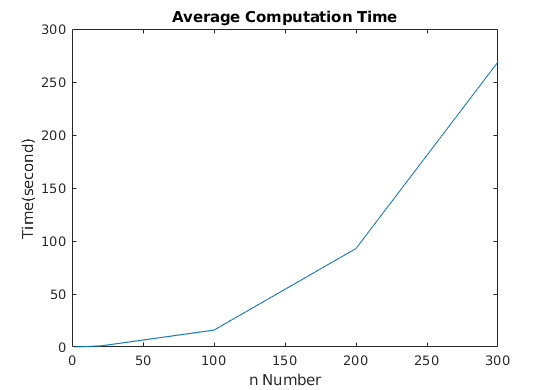
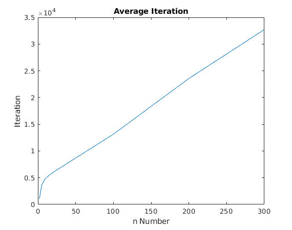

# Gradient Steepest Descent Method for Local Minimizers
This project demonstrates how the [gradient descent](https://en.wikipedia.org/wiki/Gradient_descent) algorithm can be found a local minimizer of a function at any dimension (1, 5, 10, 100, 200, 300).
# Code Implementation
Codes are implemented in Matlab R2018b.
# Description
This code demonstrates local minimizer of 5 dimensional Rosenbrock function at [-2,2] interval. Also, code can be used for any function at any dimensions. The point that must be considered is assigning initial value. Different initial values may give different local minimizer. In this problem, we wish to found local minimizer of a multidimensional function. There are four script in this project. 'gradient.m' file is to take gradient of function. 'func.m' file is for function. You can change function and try to find local minimizer of any function. 'secantmethod.m' is to one dimensional search for alpha. 'mainscript.m' combine other files and run codes.  Initial point is given following.
```   
    x = [-1 1 -0.5 -0.7 -2]
```
# Execution
To run this example, simply write at command line in the Matlab
```
	run mainscript.m
```
The output will look like this
```	
	Minimum point of the function : x = [0.999001 0.997996 0.995991 0.991975 0.983977]
	Minimum value of the function at x is 0.000086
	Error: 0.009984
	Running time of the code : 0.500374 second
```
# Conclusion
Code are implemented for different dimensions. You can see average computation time and average iteration according to dimension.

 

